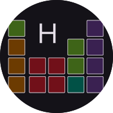

<p align="center">
  <a href="https://github.com/asahiqin/physium-aiot">
    
  </a>

  <h3 align="center">Physium</h3>
  <p align="center">
    一个适用于Vela的化学与物理小工具	
    <br />
    <a href="https://github.com/asahiqin/physium-aiot/releases/tag/v0.5.0-alpha"><strong>下载测试版（v0.5.0-alpha）</strong></a>
    <br />
    <br />
  </p>

</p>

## 简介
此quickapp受Casio计算器的Physium应用（即「理化」应用）启发，期望在小米手环上实现相关功能，方便查看物理常数、化学元素周期表等数据

## 支持设备
通过测试的有小米手环9Pro和小米手环9，按理说小米手环10也支持，但未经过实机测试

## 功能与待办
- [x] 基本元素周期表查看
- [x] 基本元素信息查看
- [x] 化学分子式计算
- [x] 物理常数表
- [x] 化学元素周期表显示金属等分类
- [x] 横向化学周期表
- [ ] 化学元素检索
- [ ] 物理常数简介

其他希望开发的功能也欢迎提出喵！


## 贡献
你可以发现，本项目有一个requirements.txt文件，同时在src/physics文件下有一个generate_data.py文件，这是用来生成物理常数LaTeX公式与相关描述的工具
如果你想要为此项目增加新的物理常数，请安装依赖并在终端运行该python文件

接下来应该会要求你输入几项内容，具体描述如下：
1. symbol: 物理量符号，可以是LaTeX公式
2. calc：该物理量是怎么计算出来的，例如Vm就是RT/p，支持LaTeX，可以留空
3. describe：对物理量的描述，不支持LaTeX
4. value：物理量的值，不支持LaTeX
5. unit：物理量单位，可以留空，支持LaTeX

默认的json会在采用值中出现

## 构建
因为米环9Pro与米环9对于图标要求不一样，而官方没有给出处理方法，所以你需要使用作者的构造脚本来编译

该编译脚本未在Windows下测试

环境要求：python 3.10及以上, nodejs, linux或macOS等类Unix系统

``` shell
git clone https://github.com/asahiqin/physium-aiot.git # 克隆仓库
cd physium-aiot
npm install # 安装依赖
python3 build.py # 编译
```

编译好的文件会出现在release文件夹下，band9前缀的是小米手环9，band9p前缀的是小米手环9Pro

## 预览图


## 调试该项目
### 1. 开发

```
npm install
npm run start
```


### 3. 调试

```
npm run watch
```
